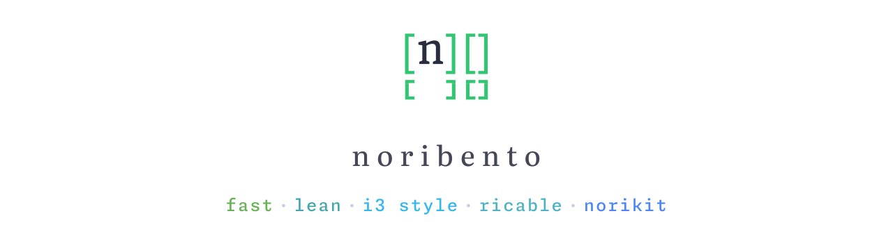

  
  
  

  <picture>
    <source media="(prefers-color-scheme: dark)" srcset="assets/hero-dark.svg"/>
    <source media="(prefers-color-scheme: light)" srcset="assets/hero-light.svg"/>
    
  </picture>

  A fast, lean tiling window manager for macOS. 
  i3-style keyboard-driven window management, inspired by the AeroSpace approach. 
  Part of the <strong>norikit</strong> ecosystem.

> [!NOTE]
> Work in progress. noribento is in early development and not yet usable.

## About

noribento is a tiling window manager for macOS that takes its cues from
[AeroSpace](https://github.com/nikitabobko/AeroSpace): an i3-style tree of
containers and emulated workspaces rather than reliance on native macOS Spaces.
The goal is a fast, lean, keyboard-driven experience that fits into the broader
**norikit** toolkit.

## License

Released under the [GNU AGPL-3.0 License](LICENSE).
